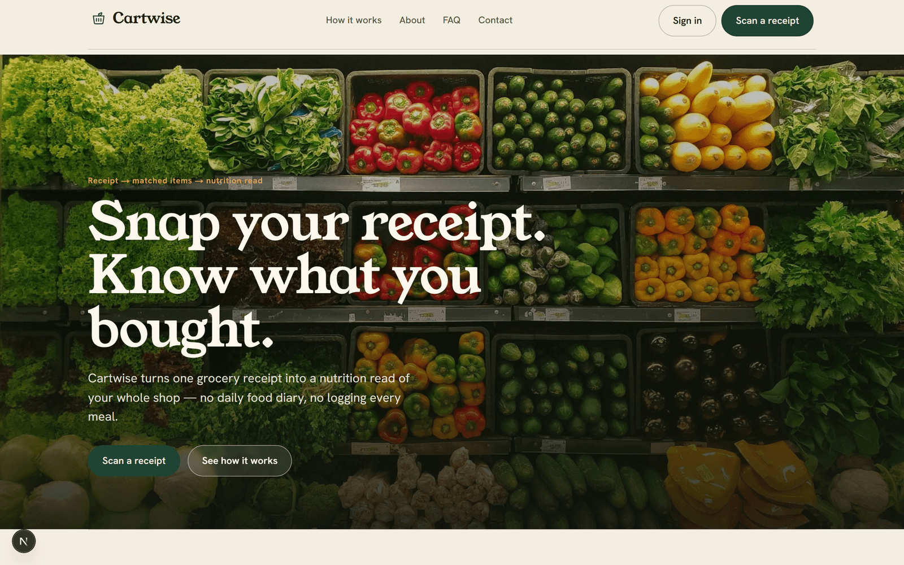
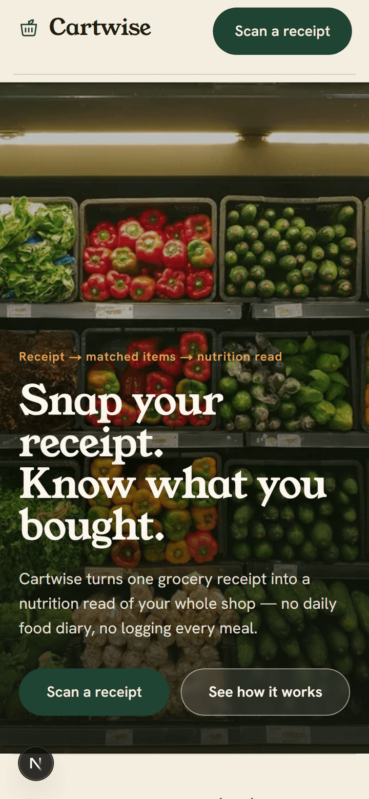
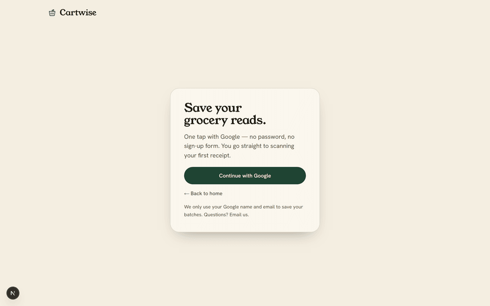
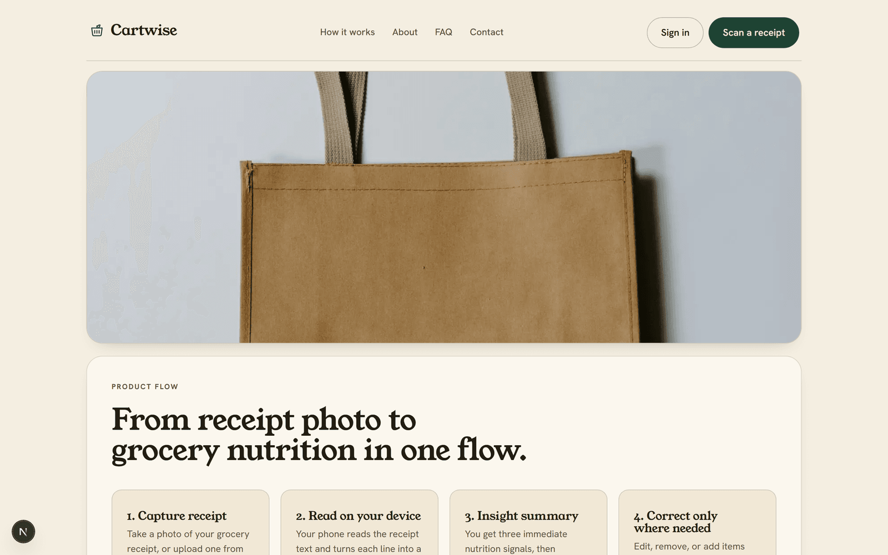
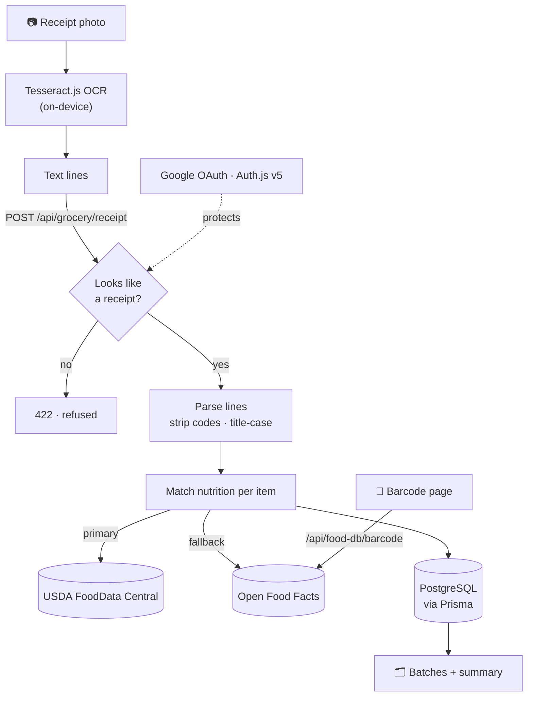

<p align="center">
  
</p>

<h1 align="center">🛒 Cartwise</h1>

<p align="center">
  <strong>Snap your grocery receipt. Know what you bought.</strong><br/>
  One receipt in, real nutrition out — no daily food diary, no logging every meal.
</p>

<p align="center">
  <a href="https://cartwise-nine.vercel.app"><strong>Live demo →</strong></a>
</p>

<p align="center">
  
  
  
  
  
  
</p>

---

## Why Cartwise

Most nutrition apps die because logging every meal is too much work — around **97% of users are gone by day 30**. Cartwise removes the logging. Your grocery **receipt is the data** you already have: photograph it once and get a plain-language read of your whole shop.

- **Zero-friction** — one Google tap, then straight to scanning. No onboarding form.
- **Honest** — nutrition comes from real databases (USDA + Open Food Facts). Items we can't match are shown as *unmatched*, never filled with made-up numbers.
- **Private** — the receipt photo is read **on your device**; only the extracted text reaches the server.

## Features

| | |
|---|---|
| 🧾 **Receipt scan** | On-device OCR reads the receipt, strips SKU/price codes, and extracts item names. |
| 🥗 **Real nutrition** | Each item is matched to USDA FoodData Central, with Open Food Facts as a fallback. |
| 📊 **Three-signal summary** | One thing to watch, one gap, one win — expandable to the full macro/micro breakdown. |
| 🔖 **Barcode lookup** | Add a single product by barcode when a receipt misses it. |
| 🗂️ **Batches** | Every scan is saved; open one to edit names, mark items eaten, or remove them. |
| 🛡️ **Guarded input** | Non-receipt images are refused with a clear message. |

## Screens

<table>
  <tr>
    <td width="34%" valign="top"></td>
    <td width="66%" valign="top">
      <br/>
      
    </td>
  </tr>
</table>

> The receipt scan and batch views live behind Google sign-in — [try them on the live demo](https://cartwise-nine.vercel.app).

## How it works



1. The browser runs OCR on the receipt and sends only the **text lines**.
2. The server checks the text really is a receipt, strips register codes, and pulls a name per line.
3. Each name is matched to real per-100g nutrition and the batch is saved to Postgres.

## Tech stack

- **Framework** — Next.js 15 (App Router), React 19, TypeScript (strict)
- **Auth** — Auth.js (NextAuth v5), Google OAuth, JWT sessions
- **Data** — Prisma ORM + PostgreSQL (Neon/Supabase)
- **OCR** — Tesseract.js (runs client-side)
- **Nutrition** — USDA FoodData Central + Open Food Facts
- **Styling** — hand-written CSS design tokens, light + dark mode, `next/image`
- **Tests / CI** — Vitest + GitHub Actions (lint · typecheck · test · build)

## Getting started

```bash
git clone https://github.com/kandulanikhilvarma/cartwise.git
cd cartwise
npm install
cp .env.example .env      # fill in the values below
npx prisma migrate dev    # create tables
npm run dev               # http://localhost:3000
```

### Environment (`.env`)

| Variable | What it is |
|---|---|
| `DATABASE_URL` | PostgreSQL connection string (see deploy note) |
| `NEXTAUTH_SECRET` | `openssl rand -base64 32` |
| `GOOGLE_CLIENT_ID` / `GOOGLE_CLIENT_SECRET` | Google OAuth web client |
| `USDA_FDC_API_KEY` | Free key: https://fdc.nal.usda.gov/api-key-signup |
| `GITHUB_ID` / `GITHUB_SECRET` | Optional GitHub provider |

`NEXTAUTH_URL` is optional — `trustHost` infers it. Set it only to pin a domain.

## Testing

```bash
npm test        # vitest — nutrition lookup, receipt parsing, insights
npm run build   # production build
```

## Deployment (Vercel + Postgres)

Push to `main` and Vercel builds it. Two gotchas worth knowing:

- **Use the pooled database URL.** Serverless functions are IPv4; a Supabase/Neon *direct* host (`db.*.supabase.co:5432`) is IPv6-only and won't connect. Use the **transaction pooler** (`…pooler.supabase.com:6543?pgbouncer=true`).
- **Add the production redirect URI** to your Google OAuth client: `https://<domain>/api/auth/callback/google`.

## Project structure

```
src/
├── app/                    # routes: marketing, (auth), (app), api
├── features/               # grocery · scanner · nutrition · auth
├── infrastructure/         # ocr (parse + client OCR) · services · state · db
└── shared/                 # components (logo, nav, footer) · lib · config
prisma/schema.prisma        # User · GroceryBatch · GroceryItem
```

## Roadmap

Manual food log · photo food recognition · additive/ingredient flags · deficiency alerts · weekly pattern insights · calorie targets · data export.

## License

[Apache 2.0](LICENSE).

---

<p align="center">
  Built by <strong>Nikhilvarma Kandula</strong> ·
  <a href="https://www.linkedin.com/in/nikhilvarmakandula">LinkedIn</a> ·
  <a href="https://kandula.studio">Portfolio</a> ·
  <a href="mailto:kandulanikhilvarma@gmail.com">Email</a>
</p>
