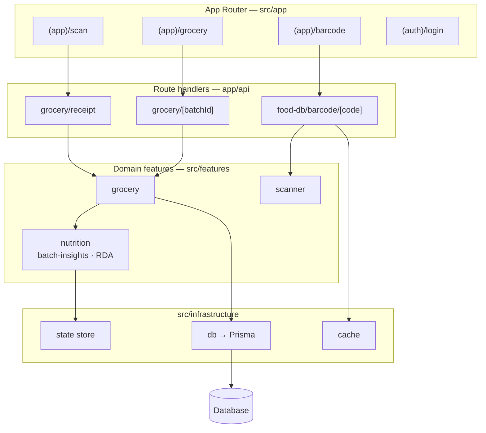

# FoodLens

FoodLens is the working repo for NutriLens, a receipt-first grocery nutrition app.

   [](LICENSE)

## Current focus
- Public value-first landing page
- Receipt OCR upload flow
- Grocery batch pages
- Barcode fallback
- Simple nutrition summary
- Google OAuth flow wired in repo

## Status
- Next.js 15 scaffold is in place
- Route groups exist for app and auth surfaces
- Receipt OCR flow is wired
- Barcode lookup uses Open Food Facts with a cached fallback
- Google sign-in route is wired
- Prisma schema is present
- Build currently passes

## Env
- `GOOGLE_CLIENT_ID`
- `GOOGLE_CLIENT_SECRET`
- `NEXTAUTH_SECRET`
- `NEXTAUTH_URL`
- `DATABASE_URL`

## Structure
- `src/app/` - routes and pages
- `src/features/` - domain features
- `src/shared/` - shared UI, config, and helpers
- `src/infrastructure/` - db, cache, and services
- `prisma/` - schema and migrations
- `docs/` - specs and notes
- `tests/` - unit and e2e tests

## Architecture



- **App Router** — a receipt-first flow across the `scan`, `grocery`, and `barcode` route groups, with an auth group for Google sign-in.
- **Route handlers** — receipt upload, grocery-batch CRUD, and barcode lookups under `app/api`.
- **Features** — domain logic in `scanner`, `grocery`, and `nutrition` (RDA constants + batch insights).
- **Infrastructure** — Prisma-backed persistence, a cache layer, and client state.

## Run
```bash
npm install
npm run dev
npm run build
```

## Working rules
- Use `ponytail` by default for implementation work
- Keep code minimal and avoid extra abstractions
- When asked for a review, switch to code-review mode
- In review mode, focus on bugs, regressions, and missing tests

## Source of truth
- `PRD_NutriLens_v2.md`
- `TRD_NutriLens_v2.md`
- `ADR_002_receipt_entry_point.md`

## License

Released under the Apache License 2.0 — see [LICENSE](LICENSE).

---

Built by **Nikhilvarma Kandula** · [LinkedIn](https://www.linkedin.com/in/nikhilvarmakandula) · [Portfolio](https://kandula.studio)