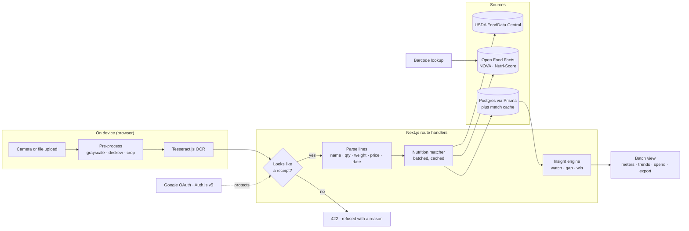
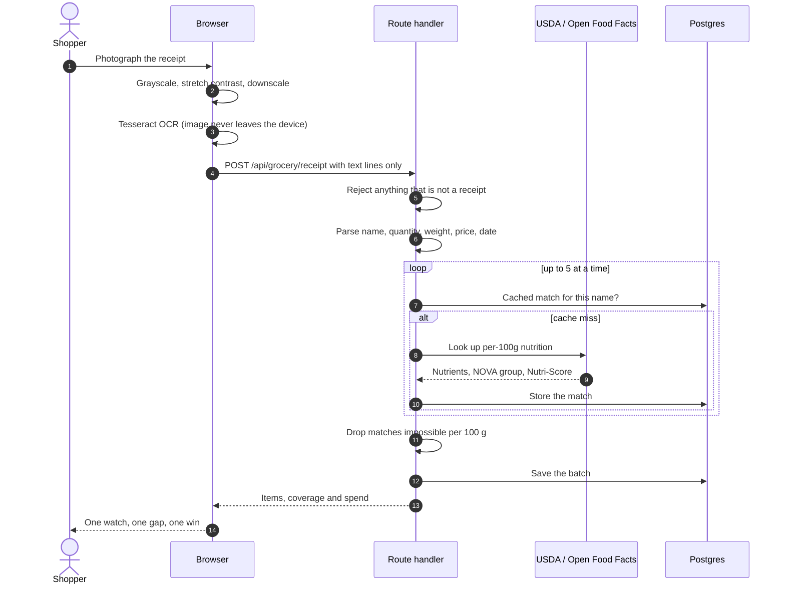
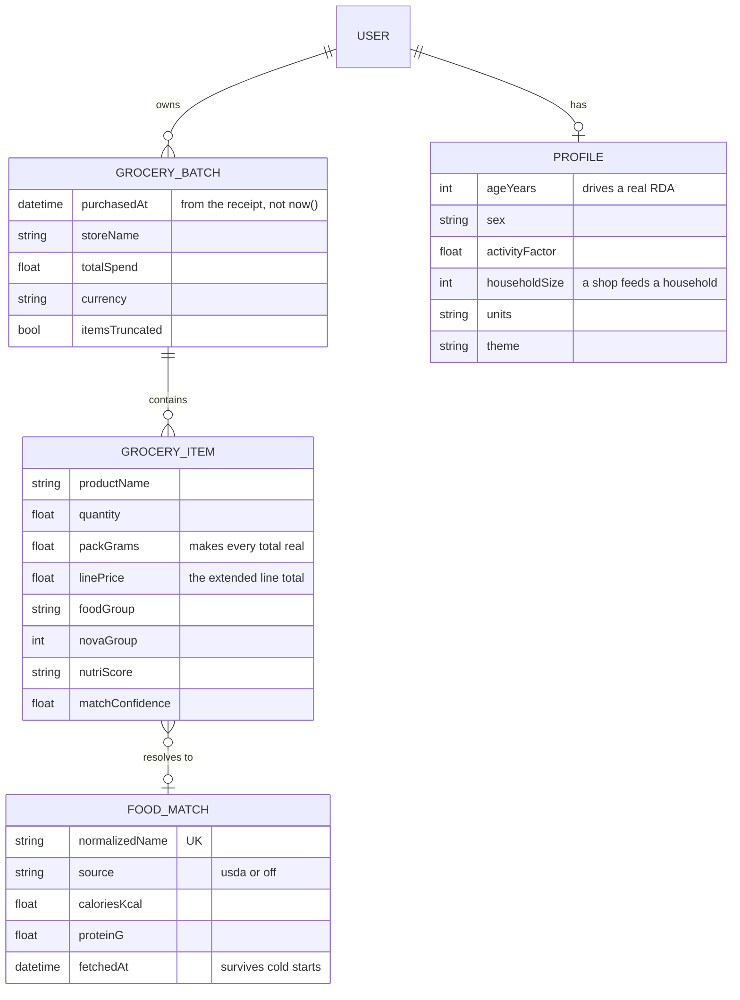
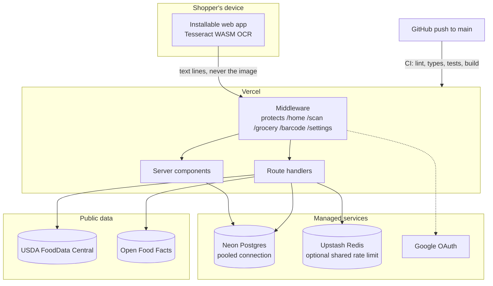

<p align="center">
  
</p>

<h1 align="center">🛒 Cartwise</h1>

<p align="center">
  <strong>Snap your grocery receipt. Know what you bought.</strong><br/>
  One receipt in, real nutrition out — no daily food diary, no logging every meal.
</p>

<p align="center">
  <a href="https://cartwise-nine.vercel.app"><strong>Live demo</strong></a> ·
  <a href="https://cartwise-nine.vercel.app/demo"><strong>See it work without an account</strong></a>
</p>

<p align="center">
  
  
  
  
  
  
</p>

---

## Why Cartwise

Most nutrition apps die because logging every meal is too much work — around **97% of users are gone by day 30**. Cartwise removes the logging. Your grocery **receipt is the data** you already have: photograph it once and get a plain-language read of your whole shop.

- **Zero-friction** — one Google tap, then straight to scanning. No onboarding form.
- **Honest** — nutrition comes from real databases (USDA + Open Food Facts). Items we can't match are shown as *unmatched*, never filled with made-up numbers. Matches that are physically impossible per 100 g are thrown away rather than displayed.
- **Private** — the receipt photo is read **on your device**; only the extracted text reaches the server.

## What makes the numbers real

Nutrition databases report **per 100 g**. Adding those figures across a trolley describes "twelve arbitrary 100 g portions", not your shop. Cartwise therefore reads the **weight printed on each line** and scales by it:

| | |
|---|---|
| `ORGANIC BANANAS 1.24 kg 2.18` | 1,240 g × 89 kcal/100 g = **1,104 kcal** |
| Line with no stated weight | **excluded from totals** and reported in coverage, not guessed at |

And a shop is a **week's supply for a household**, not one person's day — so a full trolley isn't reported as an excess. Household size lives in Settings.

## Features

| | |
|---|---|
| 🧾 **Receipt scan** | On-device OCR with contrast and downscale pre-processing, then SKU/price stripping to leave the product name. |
| ⚖️ **Weighted totals** | Pack weights read off the receipt scale every figure. Unweighed items stay out of the totals and say so. |
| 🥗 **Real nutrition** | USDA FoodData Central first, Open Food Facts as fallback, plus NOVA processing group and Nutri-Score. |
| 📊 **Watch · gap · win** | One thing running high, one thing missing, one thing that went right — then meters against a week for your household. |
| 💷 **Spend** | Prices already on the receipt become cost by food group and cost per gram of protein. |
| 🗂️ **Batches** | Search, sort, rename, delete, export to CSV. Undo on item removal. |
| 🔖 **Barcode lookup** | Add a single product by barcode when a receipt misses it. |
| 🌗 **Light and dark** | A full parallel palette with an explicit toggle, plus reduced-motion and forced-colors support. |
| 🛡️ **Guarded input** | Non-receipt images are refused with a clear message; lines with no price or weight are not treated as food. |

## Screens

<table>
  <tr>
    <td width="34%" valign="top"></td>
    <td width="66%" valign="top">
      <br/>
      
    </td>
  </tr>
</table>

> The scan and batch views live behind Google sign-in. [`/demo`](https://cartwise-nine.vercel.app/demo) runs a real receipt through the real pipeline with no account.

## Architecture



### One scan, end to end



### Data model



### Deployment



## Tech stack

- **Framework** — Next.js 15 (App Router), React 19, TypeScript (strict)
- **Auth** — Auth.js (NextAuth v5), Google OAuth, JWT sessions
- **Data** — Prisma ORM + PostgreSQL (Neon), with a `FoodMatch` cache table
- **OCR** — Tesseract.js, client-side, with canvas pre-processing
- **Nutrition** — USDA FoodData Central + Open Food Facts
- **Styling** — hand-written CSS design tokens; Young Serif, Hanken Grotesk, Fragment Mono
- **Tests / CI** — Vitest + GitHub Actions (lint · typecheck · test · build) + CodeQL

## Design

The visual system is recorded in [DESIGN.md](DESIGN.md) — warm paper ground, one committed grocery-green, marmalade accent used only where it clears contrast, and a monospace for every figure. Tokens live in [`src/app/globals.css`](src/app/globals.css) and nothing sets a raw colour at the component.

## Getting started

```bash
git clone https://github.com/kandulanikhilvarma/foodlens.git
cd foodlens
npm install
cp .env.example .env      # fill in the values below
npx prisma migrate dev    # create tables
npm run dev               # http://localhost:3000
```

Without `DATABASE_URL` the app runs against an in-memory store, so you can try the flow before setting up Postgres. `/demo` works with no database and no account at all.

### Environment (`.env`)

| Variable | Required | What it is |
|---|---|---|
| `DATABASE_URL` | for persistence | PostgreSQL connection string (see deploy note) |
| `NEXTAUTH_SECRET` | yes | `openssl rand -base64 32` |
| `GOOGLE_CLIENT_ID` / `GOOGLE_CLIENT_SECRET` | yes | Google OAuth web client |
| `USDA_FDC_API_KEY` | recommended | Free key: https://fdc.nal.usda.gov/api-key-signup — without it, Open Food Facts alone is used |
| `NEXT_PUBLIC_SITE_URL` | no | Canonical origin. Vercel's own URL is used when unset |
| `UPSTASH_REDIS_REST_URL` / `UPSTASH_REDIS_REST_TOKEN` | no | Shares the rate limiter across serverless instances |
| `GITHUB_ID` / `GITHUB_SECRET` | no | Optional GitHub provider |

`NEXTAUTH_URL` is optional — `trustHost` infers it. Set it only to pin a domain.

## Testing

```bash
npm test        # vitest — parsing, weighting, references, lookup guards
npm run build   # production build
```

## Deployment (Vercel + Postgres)

Push to `main` and Vercel builds it. Three things worth knowing:

- **Use the pooled database URL.** Serverless functions are IPv4; a Neon/Supabase *direct* host is IPv6-only and won't connect. Use the **pooled** connection string.
- **Add the production redirect URI** to your Google OAuth client: `https://<domain>/api/auth/callback/google`.
- **The rate limiter is per-instance** unless `UPSTASH_REDIS_REST_*` is set, which means it does not actually bound a multi-instance deployment.

## Project structure

```
src/
├── app/                    # routes: marketing, demo, (auth), (app), api
│   ├── icon.svg · manifest.ts · robots.ts · sitemap.ts · opengraph-image.tsx
├── features/               # grocery · scanner · nutrition · settings · auth
├── infrastructure/         # ocr (parse + client OCR) · services · state · db · cache
└── shared/                 # components (logo, nav, meter, theme) · lib · config
prisma/schema.prisma        # User · Profile · GroceryBatch · GroceryItem · FoodMatch
```

## Roadmap

Manual food log · photo food recognition · additive and allergen flags · deficiency alerts over time · calorie targets · shared household accounts.

## License

[Apache 2.0](LICENSE).

---

<p align="center">
  Built by <strong>Nikhilvarma Kandula</strong> ·
  <a href="https://www.linkedin.com/in/nikhilvarmakandula">LinkedIn</a> ·
  <a href="https://kandula.studio">Portfolio</a> ·
  <a href="mailto:kandulanikhilvarma@gmail.com">Email</a>
</p>
